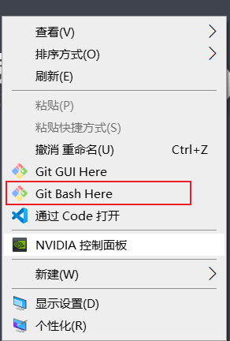
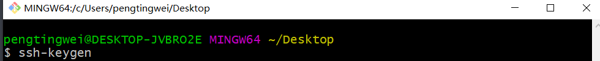
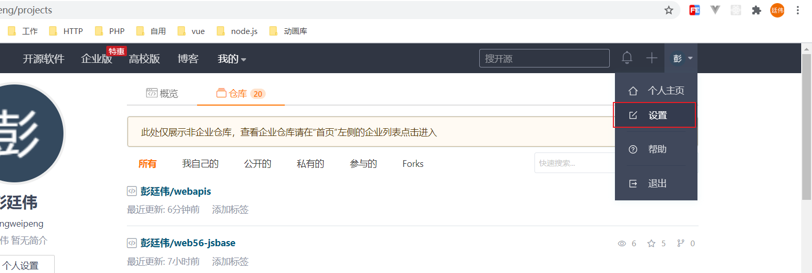
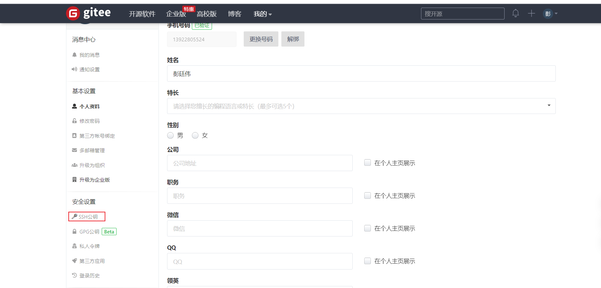
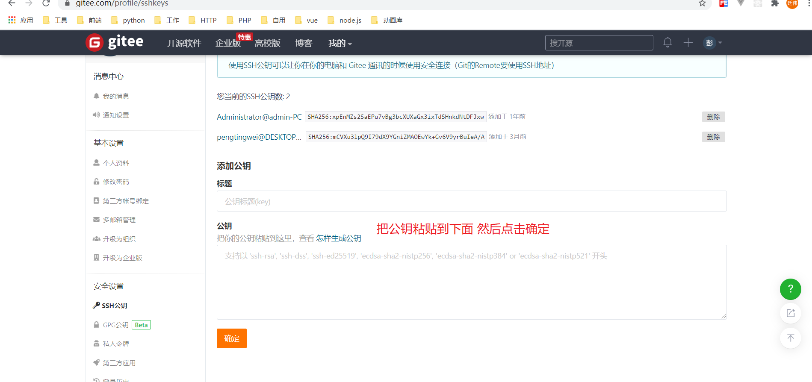
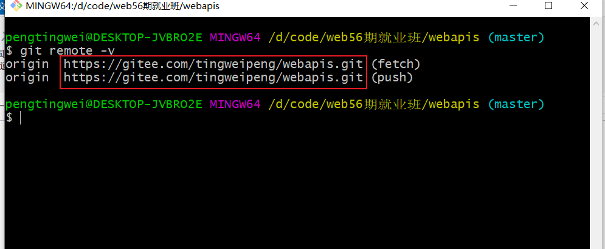
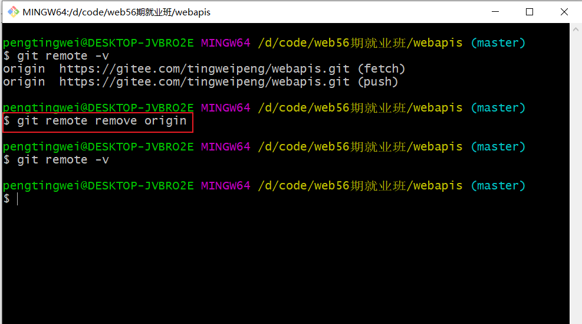
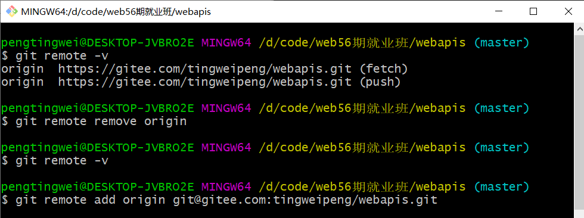

第一步：打开 git_bash 这个窗口





 生成的密钥在C:\\\\Users\当前用户名称\\.ssh 文件夹里面

在`gitee`网站中添加公钥



找到ssh公钥






可以将之前的 `https`仓库地址给删除 然后再增加新的 ssh协议的仓库地址

```bash
# 查看别名
git remote -v
```



```bash
# 删除别名
# git remote remove 别名名称
git remote remove origin
```



需要重新给我们的添加别名 

```bash
# git remote add 别名 ssh地址
```

