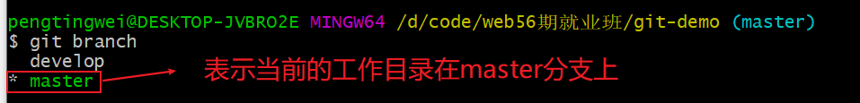
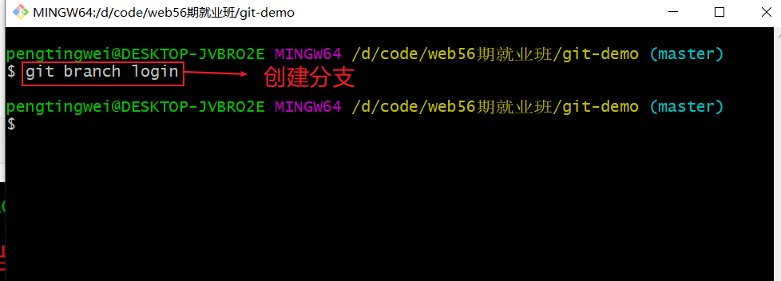
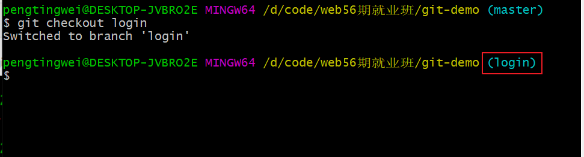
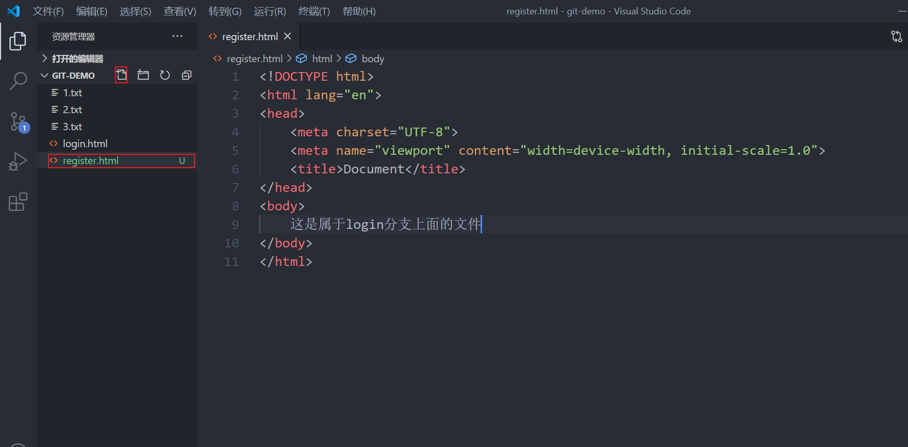
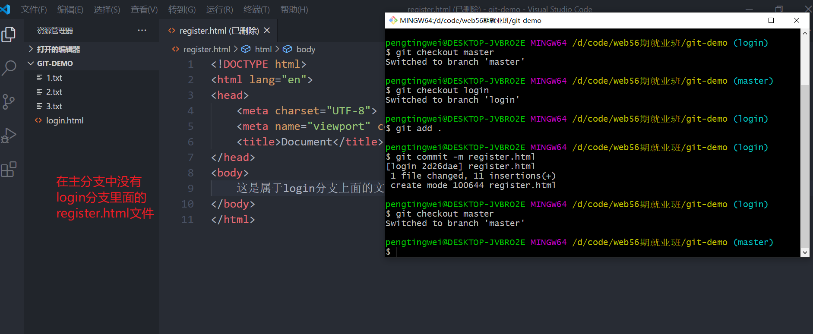
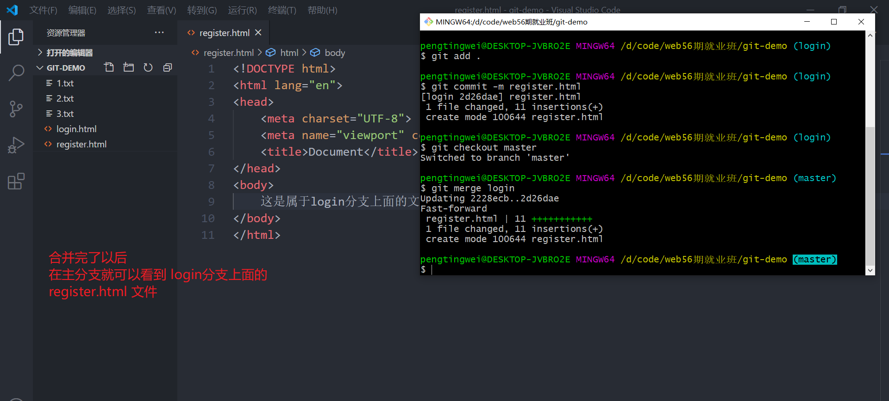

第一步：查看分支

```bash
git branch
```



第二步：创建分支

```bash
# git branch 分支名称
git branch login
```



第三步：切换分支

```bash
# git checkout 需要切换的分支名称
git checkout login
```



第四步：在当前的分支上面新建一个叫 `register.html`



第五步：将当前分支上面的代码提交到本地仓库

```bash
# 将当前分支上面的文件与文件夹提交到暂存区
git add .
# 将暂存区里面代码提交到本地仓库
git commit -m 提交信息
```

第六步：切换到`master`

```bash
# 切换到主分支
git checkout master
```



第七步：需要站在主分支上面去将login分支合并

```bash
# git merge 需要合并的分支
git merge login
```



第八步：可选

根据要求看看是否需要将login分支删除

```bash
git branch -d 要删除的分支
```

